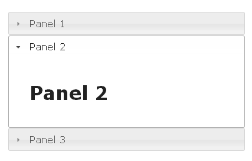
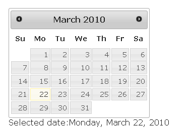
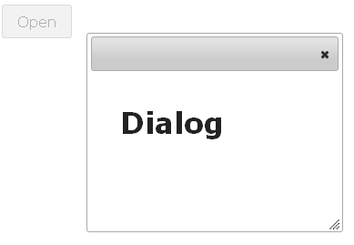

# Usage

This document explains the main points in using WebSharper.JQueryUI
and how it differs from the JavaScript library. You can also check
[some examples](Examples.md).

The original library, jQuery UI 1.10.3, works by doing a jQuery
selection on an element and calling the relevant widget constructor as
an instance member, for example:

```javascript
$("#datepicker").datepicker();
```

In the jQuery UI binding for WebSharper™ widgets like `Datepicker` are
represented as types.  To create the corresponding `Datepicker` widget
with WebSharper™ you write:

```fsharp
let datePicker = Datepicker.New()
```

The `datePicker` object now contains the available methods.  For
example, to call the `getDate` methods you use:

```fsharp
let date = datePicker.GetDate()
```

## Resource Dependencies

Using the JQuery UI WebSharper™ extension within a WebControl will automatically
include the required JavaScript and Css resources.

You may override the location of the fetched resources by modifying the `app settings`
in in your `web.config` file.

There are two configurable values: One for the root folder of the JavaScript files and
another one for the root folder of the Css files. Here is an example of how to override 
both settings.

```xml
<appSettings>
  <add key="IntelliFactory.WebSharper.JQueryUI" value="scripts/jquery-ui" />
  <add key="IntelliFactory.WebSharper.JQueryUICss" value="css/jquery-ui" />
</appSettings>
```

If you want to serve the resource files locally you need to make sure to you use the same
naming conventions as used by the online repository.


## Constructors

Constructor functions are provided for all `Widgets` and `Effects`.
There are typically a few options for constructing Widgets depending
on the desired configuration.

In the original jQuery UI library configuration settings are usually
passed as a JavaScript object.  For example, a calendar may be
initialized in a disabled state by passing a configuration setting to
the constructor function:

```javascript
$("#datepicker").datepicker({{ disabled: true }});
```

In WebSharper™ configuration settings for any widget are represented
by a corresponding configuration type and may be passed to the
constructors as parameters:

```fsharp
let conf = DatepickerConfiguration(Disabled = true)
let datePicker = Datepicker.New(conf)
```

## Methods

jQuery UI methods are represented as member methods on the objects returned when
creating a widget.  Typically the widget and effect objects contain
some common methods like `destroy`, `enable`, `disable`, and `option`.

For example, the `Datepicker` widget has a method for setting the
date. The JavaScript snippet for this may look like:

```javascript
$("#datepicker").datepicker("setDate", "03/14/2010");
```

The WebSharper™ bindings contain (possibly overloaded) methods with
corresponding names:

```fsharp
datePicker.SetDate(new Date(2010,03,14))
```


## Warning about Initialization

The fundamental difference between original jQuery UI JavaScript
widgets and their WebSharper™ counterparts is that in JavaScript the
constructor methods are typically called on elements already attached
to the DOM tree.  For example, in order for the following code to
work:

```javascript
$(selector).datepicker();
```

the selector needs to refer to an element already attached to the
page.

In WebSharper™ you normally do not work with inserted nodes,
so whenever you call constructor method such as:

```fsharp
Datepicker.New()
```

the actual initialization of the internal element is delayed until
this node is rendered to the page.

Therefore caution needs to be taken when using widget objects.  If the
widget is not yet rendered, some instance member calls may result in
runtime errors.

For example, the following code:

```fsharp
let datePicker = Datepicker.New()
datePicker.SetDate(new Date(2010,3,14))
```

will not work since the call to `SetDate` assumes that the
`datePicker` object is rendered.

Since all widgets implement the `IPagelet` interface you may use the
`OnAfterRender` function to accomodate for this.

You may rewrite the code above using the `OnAfterRender` as in:

```fsharp
DatePicker.New() 
|> OnAfterRender(fun datePicker -> 
    datePicker.SetDate(new Date(2010,3,14))
)
```


## Events

jQuery UI widgets allow to add event handlers to widgets. For example,
the `Datepicker` widget supports the `onSelect` event:

```javascript
$("#datepicker").datepicker({
   onSelect: function(dateText, inst) { ... }
});
```

In the WebSharper™ binding Events are also represented as
functions. To add an event handler for a Datepicker objects you use:

```fsharp
datePicker.OnSelect (fun date -> ...)
```

The `OnSelect` function accepts a callback function of type
`JavaScript.Date -> unit`.  The signatures of the callback functions
differ slightly from their JavaScript counterparts.  For example, the
JavaScript callback function may accept two arguments, with the second
one representing a reference to the `datePicker` object and the date
is passed as a string rather than a `DateTime` object.

In contrast with other method invocations, events may be applied to
objects that has not yet been initialized (rendered).  If an event is
attached to a non initialized object it is implicitly delayed until
the rendering of the object. Therefore the following code is
perfectly valid:

```fsharp
let datePicker = DatePicker.New() 
datePicker.OnSelect(fun date -> ...)
```

# Examples

This document lists a few usage examples of WebSharper.JQueryUI. To
read on the principles of WebSharper.JQueryUI and how it differs from
the JavaScript library, check the [main documentation](WebSharperJQueryUI.md).

## Accordion

The following example shows how to wrap elements inside an Accordion
widget.

```fsharp
[<JavaScript>]
let Accordion () =
    let accElems =
        [
            "Panel 1", H1 [Text "Panel 1"]
            "Panel 2", H1 [Text "Panel 2"]
            "Panel 3", H1 [Text "Panel 3"]
        ]
    let accordion = Accordion.New(accElems)
    Div [accordion]
```

Result:




## Datepicker

The datepicker provides a convenient way of letting the user select
dates.  Here a label is updated with the most recently selected date
by utilizing the `OnSelect` function.

```fsharp
[<JavaScript>]
let PickDate () =
    let datepicker = Datepicker.New()
    let selDate = Label []
    datepicker.OnSelect (fun dt ->
        selDate.Text <- dt.ToLocaleDateString()
    )
    Div [
        Div [Label [Text "Selected date:"]; selDate]
    ]
```




## Dialog

An example of how you can use the `Dialog` and `Button` widgets:

```fsharp
[<JavaScript>]
let Dialog () =
    let button = Button.New "Open"        
    let pan = Div [button]
    button.OnClick (fun ev ->            
        let dialog = Dialog.New(H1 [Text "Dialog"])
        pan.Append(dialog)
        dialog.OnClose(fun ev ->
            button.Enable()
        )
        button.Disable()
    )
    pan
```

The button is created using the `New` constructor with a string
argument specifying the label.  To add an event handler for the click
for the button you use the `button.OnClick` function.  Here a new
`Dialog` object is created and the button is disabled. To enable the
button again when the dialog closes you use the OnClose function for
the dialog.




## Slider

The following sample shows how to use the slider widget to let the
user specify a percentage value.

```fsharp
[<JavaScript>]
let Slider () =
    let slider = Slider.New()
    let selVal = Label []
    slider.OnChange(fun ev ->
        selVal.Text <- string slider.Value + "%"
    )
    Div [
        Div [
            Label [Text "Selected Value: "]
            selVal            
        ]
        -< [
            slider
        ]
    ]		
```

To capture the change event for the slider you add an event handler
for the `OnChange` event. Every time the value of the slider changes,
the text property of the `selVal` label is updated with the most
recent text.


## Tabs

In the example, the widgets above are displayed using the Tabs
control.  Each widget is displayed on a a separate tab panel.

```fsharp
[<JavaScript>]
let Main () =
    let tabElems =
        [
            "Dialog", Dialog ()
            "Accordion", Accordion ()
            "Datepicker", Date ()
            "Slider", Slider ()
        ]
    let tabs = Tabs.New(tabElems, TabsConfiguration())
    Div [StyleAttribute "width:500px"] -< [tabs]
```


