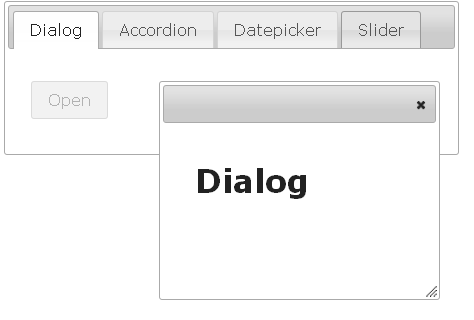

# WebSharper.JQueryUI Examples

This document lists a few usage examples of WebSharper.JQueryUI. To
read on the principles of WebSharper.JQueryUI and how it differs from
the JavaScript library, check the [main documentation](WebSharperJQueryUI.md).

## Accordion

The following example shows how to wrap elements inside an Accordion
widget.

```fsharp
[<JavaScript>]
let Accordion () =
    let accElems =
        [
            "Panel 1", H1 [Text "Panel 1"]
            "Panel 2", H1 [Text "Panel 2"]
            "Panel 3", H1 [Text "Panel 3"]
        ]
    let accordion = Accordion.New(accElems)
    Div [accordion]
```

Result:

\


## Datepicker

The datepicker provides a convenient way of letting the user select
dates.  Here a label is updated with the most recently selected date
by utilizing the `OnSelect` function.

```fsharp
[<JavaScript>]
let PickDate () =
    let datepicker = Datepicker.New()
    let selDate = Label []
    datepicker.OnSelect (fun dt ->
        selDate.Text <- dt.ToLocaleDateString()
    )
    Div [
        Div [Label [Text "Selected date:"]; selDate]
    ]
```

\


## Dialog

An example of how you can use the `Dialog` and `Button` widgets:

```fsharp
[<JavaScript>]
let Dialog () =
    let button = Button.New "Open"        
    let pan = Div [button]
    button.OnClick (fun ev ->            
        let dialog = Dialog.New(H1 [Text "Dialog"])
        pan.Append(dialog)
        dialog.OnClose(fun ev ->
            button.Enable()
        )
        button.Disable()
    )
    pan
```

The button is created using the `New` constructor with a string
argument specifying the label.  To add an event handler for the click
for the button you use the `button.OnClick` function.  Here a new
`Dialog` object is created and the button is disabled. To enable the
button again when the dialog closes you use the OnClose function for
the dialog.

\


## Slider

The following sample shows how to use the slider widget to let the
user specify a percentage value.

```fsharp
[<JavaScript>]
let Slider () =
    let slider = Slider.New()
    let selVal = Label []
    slider.OnChange(fun ev ->
        selVal.Text <- string slider.Value + "%"
    )
    Div [
        Div [
            Label [Text "Selected Value: "]
            selVal            
        ]
        -< [
            slider
        ]
    ]		
```

To capture the change event for the slider you add an event handler
for the `OnChange` event. Every time the value of the slider changes,
the text property of the `selVal` label is updated with the most
recent text.

\


## Tabs

In the example, the widgets above are displayed using the Tabs
control.  Each widget is displayed on a a separate tab panel.

```fsharp
[<JavaScript>]
let Main () =
    let tabElems =
        [
            "Dialog", Dialog ()
            "Accordion", Accordion ()
            "Datepicker", Date ()
            "Slider", Slider ()
        ]
    let tabs = Tabs.New(tabElems, TabsConfiguration())
    Div [StyleAttribute "width:500px"] -< [tabs]
```

\
